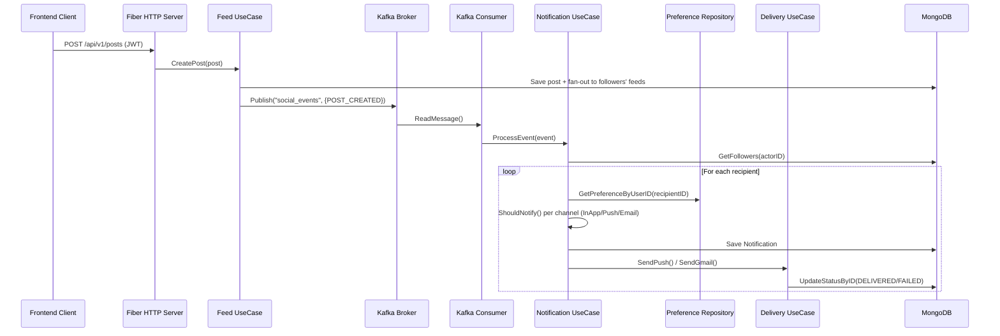

# Notification Preferences System — Complete Backend Walkthrough

## The One-Liner

A **social-media-style backend** built in Go where users can post, like, comment, and follow — and every action triggers a **preference-aware notification pipeline** that delivers via In-App, Push (FCM), and Email (SMTP), all orchestrated through **Kafka** and built on **Clean Architecture**.

---

## 1. Architecture — The Core Principle

### Clean Architecture (a.k.a. "Ports & Adapters" / "Hexagonal")

The entire codebase follows one rule:

> **Dependencies point inward.** Business logic never depends on frameworks, databases, or transport layers. It only depends on interfaces it defines itself.

This is enforced by a **"Package by Feature"** directory structure. Instead of grouping all handlers together and all repos together (layered), each feature owns its own slice of the stack:

```
internal/
├── user/                    ← Feature
│   ├── repository/          ← Data access interface + Mongo implementation
│   ├── usecase/             ← Business logic (no knowledge of HTTP or Mongo)
│   ├── handler/rest/        ← HTTP handler (Fiber) — translates HTTP ↔ UseCase
│   └── dto/                 ← Request/Response shapes
├── feed/
│   ├── repository/
│   ├── usecase/
│   └── handler/rest/
├── notification/
│   ├── repository/
│   └── usecase/
├── preference/
│   └── repository/
├── delivery/
│   └── usecase/
├── follow/
│   └── repository/
├── broker/                  ← Kafka Producer + Consumer
├── entities/                ← Shared domain models (User, Post, Event, Notification)
└── app/                     ← Composition root (wiring)
```

### Why this matters

- **Testability**: The [user usecase tests](file:///home/ritik-thakur/Desktop/notification-pref/internal/user/usecase/usecase_test.go) use a pure in-memory repository — no MongoDB needed to test business logic.
- **Swappability**: To switch from MongoDB to PostgreSQL, you only change the `repository/` files. The usecase never knows.
- **Independence**: Each feature can evolve independently. The `notification/` feature doesn't import `feed/` — they communicate through Kafka events.

---

## 2. The Data Flow — End to End

Here's what happens from user action to notification delivery:



### Step-by-step:

**① User creates a post** → `POST /api/v1/posts` hits [feed_handler.go](file:///home/ritik-thakur/Desktop/notification-pref/internal/feed/handler/rest/feed_handler.go) → calls [FeedUsecase.CreatePost()](file:///home/ritik-thakur/Desktop/notification-pref/internal/feed/usecase/feed_usecase.go#L26-L72)

**② Fan-out + Kafka event** → `CreatePost` fetches all followers via `userRepo.GetFollowers()`, builds a `FeedItem` per follower (fan-out-on-write), and publishes a `POST_CREATED` event to the `social_events` Kafka topic via [KafkaProducer.Publish()](file:///home/ritik-thakur/Desktop/notification-pref/internal/broker/kafka_producer.go#L27-L48)

**③ Kafka Consumer picks it up** → [KafkaConsumer.Start()](file:///home/ritik-thakur/Desktop/notification-pref/internal/broker/kafka_consumer.go#L36-L76) runs in a goroutine, continuously reading from the topic. It unmarshals the JSON into `entities.Event` and calls `NotificationService.ProcessEvent()`.

**④ Preference resolution** → [ProcessEvent()](file:///home/ritik-thakur/Desktop/notification-pref/internal/notification/usecase/notification_usecase.go#L220-L267) is the brain:
  - Determines **who** should receive the notification via `GetRecipientsByActionType()` (e.g., for a LIKE → the post owner; for a POST → all followers)
  - For each recipient, fetches their **notification preferences** from MongoDB
  - Calls `GetActionPrefs()` to extract the channel config for this specific action type (likes, comments, posts, follows)
  - For each channel (InApp, Push, Email), calls `ShouldNotify()` which resolves the preference level:
    - `ALL` → always notify
    - `FOLLOWERS` → notify only if the recipient follows the actor (checked via `FollowRepository.IsFollowing()`)
    - `NONE` → skip

**⑤ Notification creation** → A `Notification` document is created with per-channel delivery statuses (SENT, PENDING, SKIPPED) and saved to MongoDB.

**⑥ Delivery** → If Push is enabled, [DeliveryUseCase.SendPush()](file:///home/ritik-thakur/Desktop/notification-pref/internal/delivery/usecase/delivery_usecase.go#L73-L103) sends via Firebase Cloud Messaging. If Email is enabled, `SendGmail()` sends via SMTP. Both update the notification's delivery status in MongoDB afterward.

---

## 3. The Preference Model

Each user has a `NotificationPreferences` object embedded in their profile (defined in [user.go](file:///home/ritik-thakur/Desktop/notification-pref/internal/entities/user.go#L34-L39)):

```go
type NotificationPreferences struct {
    Likes    ChannelConfig   // For "someone liked your post"
    Comments ChannelConfig   // For "someone commented on your post"
    Follows  ChannelConfig   // For "someone followed you"
    Posts    ChannelConfig   // For "someone you follow posted"
}

type ChannelConfig struct {
    InApp PreferenceLevel   // "ALL" | "FOLLOWERS" | "NONE"
    Push  PreferenceLevel
    Email PreferenceLevel
}
```

This gives users **per-action, per-channel** control. For example:
- "I want In-App notifications for all likes, but Push only from people I follow, and no emails."
- "I want email notifications for new posts from people I follow, but nothing for follows."

---

## 4. REST API Endpoints

### Public (no auth required) — [public_routes.go](file:///home/ritik-thakur/Desktop/notification-pref/pkg/routes/public_routes.go)

| Method | Endpoint | Description |
|--------|----------|-------------|
| POST | `/api/v1/auth/signup` | Register a new user (bcrypt-hashed password) |
| POST | `/api/v1/auth/signin` | Login, returns JWT token (72hr expiry) |
| GET | `/api/v1/users/` | List all users |
| GET | `/api/v1/users/:id` | Get user by ID |
| PATCH | `/api/v1/users/:id` | Update user profile |
| DELETE | `/api/v1/users/:id` | Delete user |

### Private (JWT required) — [private_routes.go](file:///home/ritik-thakur/Desktop/notification-pref/pkg/routes/private_routes.go)

| Method | Endpoint | Description |
|--------|----------|-------------|
| POST | `/api/v1/posts` | Create a post (triggers fan-out + Kafka event) |
| POST | `/api/v1/posts/:id/like` | Like a post (triggers Kafka event) |
| POST | `/api/v1/posts/:id/comment` | Comment on a post (triggers Kafka event) |
| GET | `/api/v1/feed` | Get the authenticated user's timeline |
| GET | `/api/v1/me` | Get current user's profile |
| POST | `/api/v1/users/:id/follow` | Follow a user (triggers Kafka event) |
| DELETE | `/api/v1/users/:id/follow` | Unfollow a user |

---

## 5. Dependency Wiring — The Composition Root

Everything gets wired in [app.go](file:///home/ritik-thakur/Desktop/notification-pref/internal/app/app.go) and [private_routes.go](file:///home/ritik-thakur/Desktop/notification-pref/pkg/routes/private_routes.go):

```
main.go
  └→ app.Start()
       └→ SetupDependencies() → MongoDB connection + Config
       └→ SetupRestServer()
            └→ KafkaProducer (for publishing events)
            └→ RegisterPublicRoutes() → UserRepo → UserUseCase → UserHandler
            └→ RegisterPrivateRoutes()
                 ├→ FeedRepo, UserRepo, PrefRepo, NotifRepo  (all Mongo-backed)
                 ├→ DeliveryUseCase (SMTP + FCM)
                 ├→ NotificationUseCase (wired with ALL repos + delivery)
                 ├→ KafkaConsumer.Start() ← goroutine (feeds events into NotificationUseCase)
                 ├→ FeedUseCase → FeedHandler (HTTP endpoints)
                 └→ UserUseCase → UserHandler (HTTP endpoints)
```

> [!IMPORTANT]
> **No `new` keyword scattered around handlers.** All dependencies are created at the top of the route registration functions and injected via constructor functions. This is **manual Dependency Injection** — the Go way, no framework needed.

---

## 6. Tech Stack Summary

| Layer | Technology |
|-------|-----------|
| HTTP Framework | [GoFiber v2](https://gofiber.io/) |
| Database | MongoDB (via official `mongo-driver`) |
| Message Broker | Apache Kafka (via `segmentio/kafka-go`) |
| Push Notifications | Firebase Cloud Messaging (FCM) |
| Email | SMTP (via Go's `net/smtp`) |
| Authentication | JWT (via `golang-jwt/jwt/v5`) + bcrypt |
| Testing | `testify/suite` + in-memory repositories |

---

## 7. Key Design Decisions to Highlight

1. **Event-Driven Architecture** — Actions don't directly create notifications. They publish events to Kafka. A separate consumer loop asynchronously processes them. This decouples the "writing a post" latency from the "notifying 10,000 followers" workload.

2. **Fan-Out-on-Write for Feed** — When a user posts, we immediately write a `FeedItem` into every follower's timeline collection. This makes feed reads O(1) instead of assembling feeds at read-time.

3. **Preference-Level Granularity** — The 3-tier preference system (`ALL`, `FOLLOWERS`, `NONE`) × 4 action types × 3 channels = **36 independent notification controls** per user, all resolved at notification time.

4. **Per-Channel Delivery Status Tracking** — Each notification stores the delivery status (`SENT`, `PENDING`, `DELIVERED`, `FAILED`, `SKIPPED`) independently for InApp, Push, and Email channels. This enables retry logic and delivery analytics.

5. **Interface-Driven Development** — Every repository and usecase is defined as a Go interface first, then implemented. This is what allows the test suite to run with zero infrastructure.
